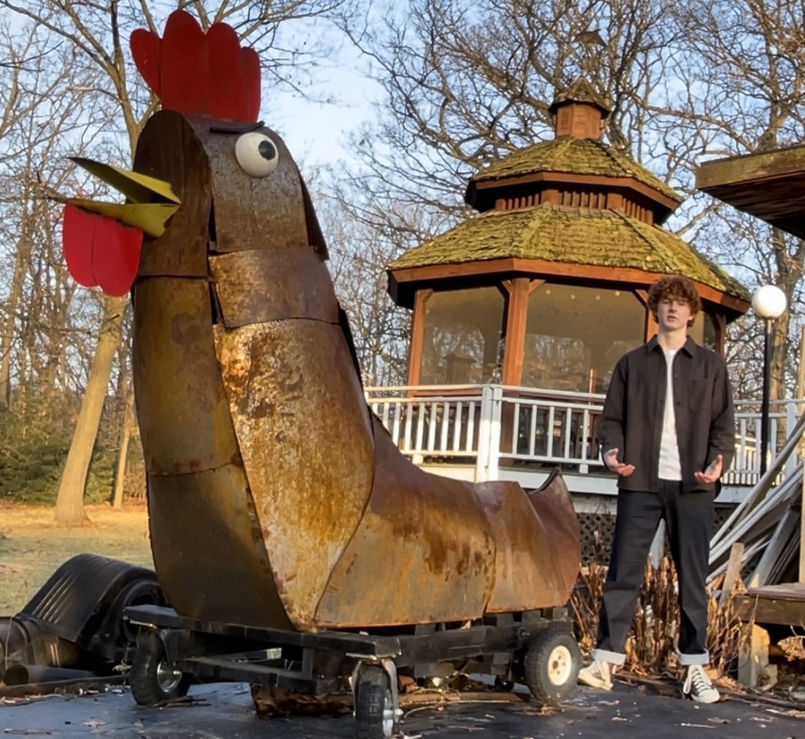

<!-- markdownlint-disable MD033 -->

<h1 align="center">Braeden Cullen </h1>
<p align="center">
  ML Engineer • Embedded Systems Engineer • Autonomous Robotics  
</p>

<p align="center">
  
</p>

<p align="center">
  <!--a href="https://www.braedencullen.com">🌐 Website</a-->
  <a href="https://www.linkedin.com/in/braeden-cullen">LinkedIn</a> •
  <a href="mailto:braeden.cullen@yale.edu">Email</a>
</p>

---

## 🐙 **About Me**

I'm a dual-degree Computer Science B.S./M.S. and Economics B.A. student at **Yale University**, building systems at the edge of autonomy, defense, and machine intelligence.

I design **real-world ML systems** that live on embedded hardware, control drones, detect gestures, navigate cluttered environments, and accelerate simulations. My work lives at the intersection of:

- **Edge AI & Robotics** — quadrupeds, UAVs, and autonomous responders  
- **Defense Systems Engineering** — live-fire C2 simulations, counter-UAS optimization  
- **Probabilistic Modeling & HPC** — convex solvers in Rust, RAG pipelines, CUDA inference  
- **Geospatial Intelligence** — analyzing foreign energy infrastructure from space  

---

## Tech Stack

```python
Languages:    Python • C/C++ • Rust • Bash • SQL
ML/AI:        PyTorch • TensorFlow • CUDA • OpenCV
Systems:      NixOS • ROS • SLURM • Docker • gRPC  
Frontend:     React • TypeScript • Node.js  
Infra:        AWS • PostgreSQL • Unix/Linux
DevOps:       Git • GitHub Actions • Nix • pytest
```

---

## 🐙 **Featured Projects**

<div align="center">

## Autonomous Robotics & Edge AI

<table>
<tr>
<td align="center" width="50%">
  
  <br><strong>APOLLO Quadruped Navigation</strong>
  <br><em>Yale APOLLO Lab</em>
  <br>Deployed object permanence and adaptive consensus modules for dynamic, cluttered environments. Built robust perception systems for autonomous navigation in unstructured terrain.
</td>
<td align="center" width="50%">
  
  <br><strong>Autonomous UAV System Architecture</strong>
  <br><em>Autonomous Aid Delivery</em>
  <br>Designed end-to-end autonomous drone control systems with real-time perception, path planning, and decision-making capabilities for tactical operations.
</td>
</tr>
<tr>
<td align="center" width="50%">
  
  <br><strong>Autonomous Drone Flight Testing</strong>
  <br><em>Field Deployment</em>
  <br>Real-world testing and validation of autonomous flight systems in challenging environmental conditions with aid delivery mission execution from a custom command and control center accessible over a webserver.
</td>
<td align="center" width="50%">
  
  <br><strong>Exploration Rover System Design</strong>
  <br><em>Planetary Robotics</em>
  <br>Architected modular robotic systems for extreme environment exploration with integrated sensing, mobility, and autonomy capabilities. Deployed and coordinated distributed compute nodes each equiped with pub/sub comms
</td>
</tr>
<tr>
<td align="center" width="50%">
  
  <br><strong>Robotic Manipulation System</strong>
  <br><em>Precision Control</em>
  <br>Developed high-precision robotic arm control systems with advanced kinematics and force feedback for delicate manipulation tasks. Aiming to compete in the University Rover Challenge by early May. Utilized inverse kinematics to estimate pose of obscured joints while performing missions.
</td>
<td align="center" width="50%">
  
  <br><strong>Humanitarian Aid UAV</strong>
  <br><em>Autonomous Navigation with a Centralized Command & Control Center</em>
  <br>Built out a command and control distributed arhictecture that fields in sensor data from individual compute nodes each serving a specific purpose, including GPS orientation, drone pose, dropper control, and realtime computer vision. Leveraged a custom-trained computer vision model to identify individuals sigaling for aid delivery.
</td>
</tr>
<tr>
<td align="center" width="50%">
  
  <br><strong>Autonomous SLAM Navigation</strong>
  <br><em>Fully Autonomous Rover</em>
  <br>Developed a SLAM-based autonomous rover capable of navigating to waypoints in foreign environments. Utilized a ZED stereoscopic camera for generating point clouds. Used ROS to coordinate distributed nodes.
</td>
<td align="center" width="50%">
  
  <br><strong>Bulldogs SAE Racing Vehicle</strong>
  <br><em>Formula Student Competition</em>
  <br>Contributed to the development of a racing vehicle chassis and control system for competing in the SAE challenge. Working to integrate full autonomy using SLAM & CV.
</td>
</tr>
<tr>
<td align="center" width="50%">
  
  <br><strong>Predictive Maintenance & Workflow Automation</strong>
  <br><em>CNC Maching & Workflow Automation</em>
  <br>Built an end-to-end GraphRAG diagnostic assistant for ASML lithography tools: ingested 2M+ service logs into a vector store, retrieved
context with bi-encoder embeddings, and ranked fixes via a custom confidence-weighted scorer. Coupled this with a reinforcement-learning tool-path optimizer that trimmed non-cut motion by predicting spindle RPM/axis feeds on the fly.
</td>
</tr>
<td align="center" width="50%">
</td>
<td align="center" width="50%">
</td>
</table>

## Defense & Intelligence Systems

<table>
<tr>
<td align="center" colspan="2" width="100%">
  
  
  <br><strong>Anduril Software Engineer</strong>
  <br><em>Command & Control (C2) Systems</em>
  <br>Architected and deployed scalable pipelines in Rust for real-time fusion of multi-source intelligence and automated threat assessment, leveraging convex-optimization techniques and high-performance computing to achieve ultra-low latency and robust decision-making.
</td>
</tr>
<tr>
<td align="center" width="50%">
  
  
  <br><strong>Geospatial Intelligence Analysis</strong>
  <br><em>National Geospatial-Intelligence Agency</em>
  <br>Advanced satellite imagery analysis and infrastructure detection using computer vision and statistical inference techniques.
</td>
<td align="center" width="50%">
  
  <br><strong>Satellite Analytics Platform</strong>
  <br><em>National Geospatial-Intelligence Agency + Yale FPI</em>
  <br>Detected covert Russian installations in North Africa using remote sensing & statistical inference with high-precision classification.
</td>
</tr>
<tr>
<td align="center" width="50%">
</td>
<td align="center" width="50%">
</td>
</tr>
</table>

## Machine Learning & AI Research

<table>
<tr>
<td align="center" width="50%">
  
  <br><strong>Graph-Based RAG Pipeline</strong>
  <br><em>Knowledge Retrieval Systems</em>
  <br>Developed advanced retrieval-augmented generation systems using graph neural networks for improved knowledge extraction and synthesis.
</td>
<td align="center" width="50%">
  
  <br><strong>Hierarchical Reinforcement Learning</strong>
  <br><em>Multi-Level Decision Making</em>
  <br>Implemented hierarchical RL frameworks for complex multi-level decision-making problems in robotics and automation.
</td>
</tr>
<tr>
<td align="center" width="50%">
  
  <br><strong>ML-Assisted CNC Planning</strong>
  <br><em>Manufacturing Automation</em>
  <br>Reinforcement learning for autonomous G-code generation and optimization, reducing planning time by 60% while improving precision.
</td>
<td align="center" width="50%">
  
  <br><strong>Climate Data Downscaling</strong>
  <br><em>Environmental Modeling</em>
  <br>Applied machine learning techniques for high-resolution climate data generation and regional weather pattern analysis. Devloped a stacked-SRCNN architecture to downscale climate radar data from vulnerable regions.
</td>
</tr>
<td align="center" width="50%">
</td>
<td align="center" width="50%">
</td>
</tr>
</table>

## Design & Machining

<table>
<tr>
<td align="center" width="50%">
  
  <br><strong>CNC Autonomy & Improving Manufacturing Workflows</strong>
  <br><em>Scrappy machining & Edge Compute</em>
  <br>Retrofit salvaged sheet-metal panels and wheelchair drivetrain components into a rideable, heavy-duty autonomous rover. Reinforced chassis framing and custom steering linkages support a seated operator, while onboard ROS edge-compute handles LiDAR/IMU sensor fusion for SLAM-based navigation and high-torque motor control for rugged terrain traversal.
</td>
<td align="center" width="50%">
  
  <br><strong>Creeper Rover</strong>
  <br><em>Woodworking and Router Machining</em>
  <br>Salvaged drivetrain and machined sheet-steel into a stable creeper rover. Engineered reinforced chassis framing, custom motor controllers, and operator joystick interface. Implemented self-stabilizing IMU-driven algos to reduce tip frequency.
</td>
</tr>
</table>

</div>

---
