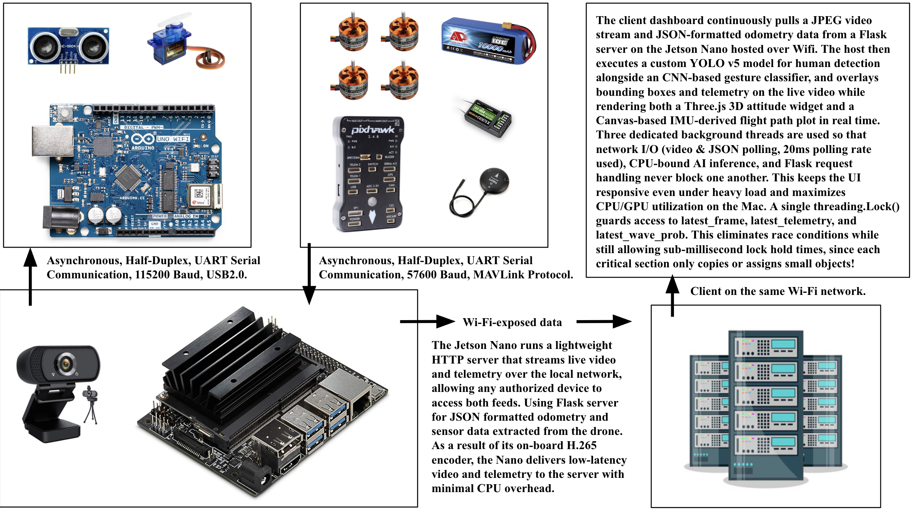

<h1 align="center">🐙 Hi, I'm Braeden Cullen 🐙</h1>
<p align="center">
  ML Engineer • Embedded Systems Engineer • Autonomous Robotics  
</p>

<p align="center">
  
</p>

<p align="center">
  <!--a href="https://www.braedencullen.com">🌐 Website</a-->
  <a href="https://www.linkedin.com/in/braeden-cullen">LinkedIn</a> •
  <a href="mailto:braeden.cullen@yale.edu">Email</a>
</p>

---

### 🧠 About Me
I'm a dual-degree Computer Science B.S./M.S. and Economics B.A. student at **Yale University**, building systems at the edge of autonomy, defense, and machine intelligence.

I design **real-world ML systems** that live on embedded hardware, control drones, detect gestures, navigate cluttered environments, and accelerate simulations. My work lives at the intersection of:

- **Edge AI & Robotics** — quadrupeds, UAVs, and autonomous responders  
- **Defense Systems Engineering** — live-fire C2 simulations, counter-UAS optimization  
- **Probabilistic Modeling & HPC** — convex solvers in Rust, RAG pipelines, CUDA inference  
- **Geospatial Intelligence** — analyzing foreign energy infrastructure from space  

---

## 🚀 Featured Projects

<div align="center">

### 🤖 Autonomous Robotics & Edge AI

<table>
<tr>
<td align="center" width="50%">
  
  <br><strong>APOLLO Quadruped Navigation</strong>
  <br><em>Yale APOLLO Lab</em>
  <br>Deployed object permanence and adaptive consensus modules for dynamic, cluttered environments. Built robust perception systems for autonomous navigation in unstructured terrain.
</td>
<td align="center" width="50%">
  
  <br><strong>Autonomous UAV System Architecture</strong>
  <br><em>Counter-UAS Defense</em>
  <br>Designed end-to-end autonomous drone control systems with real-time perception, path planning, and decision-making capabilities for tactical operations.
</td>
</tr>
<tr>
<td align="center" width="50%">
  
  <br><strong>Autonomous Drone Flight Testing</strong>
  <br><em>Field Deployment</em>
  <br>Real-world testing and validation of autonomous flight systems in challenging environmental conditions with obstacle avoidance and mission execution.
</td>
<td align="center" width="50%">
  
  <br><strong>Exploration Rover System Design</strong>
  <br><em>Planetary Robotics</em>
  <br>Architected modular robotic systems for extreme environment exploration with integrated sensing, mobility, and autonomy capabilities.
</td>
</tr>
<tr>
<td align="center" width="50%">
  
  <br><strong>Robotic Manipulation System</strong>
  <br><em>Precision Control</em>
  <br>Developed high-precision robotic arm control systems with advanced kinematics and force feedback for delicate manipulation tasks.
</td>
<td align="center" width="50%">
  
  <br><strong>Bulldogs Racing Autonomous Vehicle</strong>
  <br><em>Formula Student Competition</em>
  <br>Led development of autonomous racing vehicle chassis and control systems for competitive autonomous vehicle challenges.
</td>
</tr>
</table>

### 🛡️ Defense & Intelligence Systems

<table>
<tr>
<td align="center" width="50%">
  
  <br><strong>Geospatial Intelligence Analysis</strong>
  <br><em>National Geospatial-Intelligence Agency</em>
  <br>Advanced satellite imagery analysis and infrastructure detection using computer vision and statistical inference techniques.
</td>
<td align="center" width="50%">
  
  <br><strong>Satellite Analytics Platform</strong>
  <br><em>NGA + Yale FPI</em>
  <br>Detected covert Russian installations in North Africa using remote sensing & statistical inference with high-precision classification.
</td>
</tr>
<tr>
<td align="center" width="50%">
  
  <br><strong>Intelligence Processing Pipeline</strong>
  <br><em>Multi-Source Intelligence</em>
  <br>Built scalable data processing systems for multi-source intelligence fusion and real-time threat assessment.
</td>
<td align="center" width="50%">
  
  <br><strong>Counter-UAS Target Prioritization</strong>
  <br><em>Anduril Industries</em>
  <br>Convex optimization + Rust-based simulation suite integrated into tactical fire exercises for threat assessment and response.
</td>
</tr>
</table>

### 🧠 Machine Learning & AI Research

<table>
<tr>
<td align="center" width="50%">
  
  <br><strong>Graph-Based RAG Pipeline</strong>
  <br><em>Knowledge Retrieval Systems</em>
  <br>Developed advanced retrieval-augmented generation systems using graph neural networks for improved knowledge extraction and synthesis.
</td>
<td align="center" width="50%">
  
  <br><strong>Hierarchical Reinforcement Learning</strong>
  <br><em>Multi-Level Decision Making</em>
  <br>Implemented hierarchical RL frameworks for complex multi-level decision-making problems in robotics and automation.
</td>
</tr>
<tr>
<td align="center" width="50%">
  
  <br><strong>ML-Assisted CNC Planning</strong>
  <br><em>Manufacturing Automation</em>
  <br>Reinforcement learning for autonomous G-code generation and optimization, reducing planning time by 60% while improving precision.
</td>
<td align="center" width="50%">
  
  <br><strong>Climate Data Downscaling</strong>
  <br><em>Environmental Modeling</em>
  <br>Applied machine learning techniques for high-resolution climate data generation and regional weather pattern analysis.
</td>
</tr>
</table>

</div>

---

### 🛠️ Tech Stack

```python
Languages:    Python • C/C++ • Rust • SQL  
ML/AI:        PyTorch • TensorFlow • CUDA • GraphRAG  
Systems:      NixOS • ROS • SLURM • Docker • gRPC  
Frontend:     React • TypeScript • Node.js  
Infra:        AWS • PostgreSQL • Unix/Linux
```
